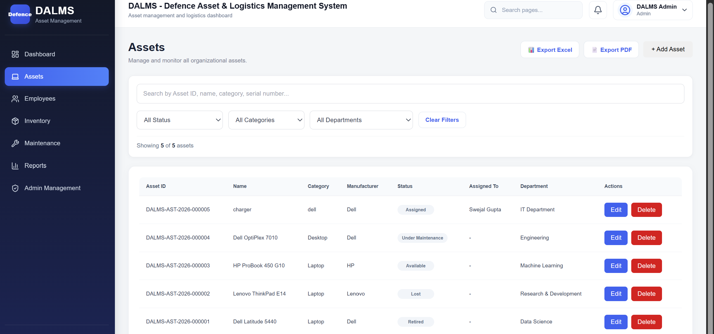
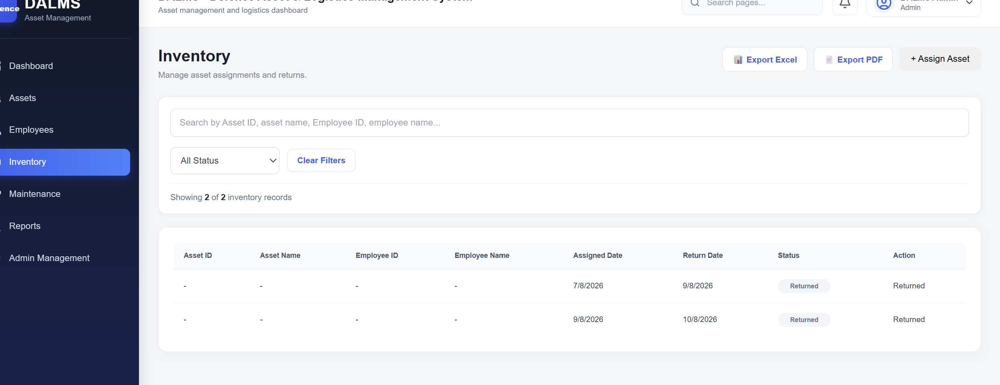
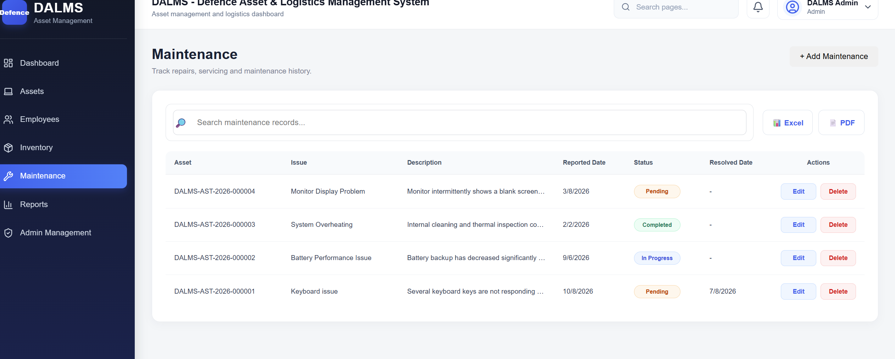

# DALMS — Defence Asset & Logistics Management System

A full-stack web-based asset and logistics management system designed to centralize and streamline the management of defence-oriented assets, employees, inventory, maintenance records, analytics, and operational reports.

DALMS provides a centralized dashboard with management modules, searchable records, data visualization, authentication, and PDF/Excel report generation.

---

## 🌐 Project Overview

Managing assets, employees, inventory, and maintenance records across multiple systems can make tracking and reporting difficult.

**DALMS (Defence Asset & Logistics Management System)** addresses this by providing a centralized management platform where authorized users can manage operational records through a structured web interface.

The system combines:

* Asset management
* Employee management
* Inventory management
* Maintenance management
* Searchable records
* Dashboard analytics
* Interactive charts
* PDF report generation
* Excel report generation
* Secure authentication
* RESTful backend APIs

---

## ✨ Key Features

### 📊 Dashboard & Analytics

* Centralized management dashboard
* Summary statistics
* Visual data representation
* Interactive charts
* Quick access to operational records

### 📦 Asset Management

* Create and manage asset records
* Unique Asset ID generation
* View asset records
* Search asset records
* Delete asset records
* Generate PDF reports
* Export records to Excel
* Data visualization

### 👥 Employee Management

* Create and manage employee records
* Search employee records
* View employee records
* Delete employee records
* Generate PDF reports
* Export records to Excel
* Data visualization

### 📋 Inventory Management

* Manage inventory records
* Search and view inventory data
* Track inventory information
* Generate PDF reports
* Export records to Excel
* Data visualization

### 🔧 Maintenance Management

* Manage maintenance records
* Search maintenance information
* View maintenance records
* Generate PDF reports
* Export records to Excel
* Data visualization

### 🔎 Search & Records

Each major management module provides searchable and structured records for easier data retrieval and management.

### 📄 Reporting & Export

DALMS provides reporting functionality across the management modules:

* PDF report generation
* Excel export
* Tabular PDF reports
* Exportable management records

### 🔐 Authentication & Security

* JWT-based authentication
* Password hashing using bcrypt
* Protected backend routes
* Environment-based configuration
* HTTP security headers using Helmet
* Input validation
* CORS configuration

### 🧪 API Testing

Backend REST APIs can be tested using the included Postman collection.

---

## 🏗️ System Architecture

```text
                    ┌─────────────────────────┐
                    │       DALMS User        │
                    └────────────┬────────────┘
                                 │
                                 ▼
                    ┌─────────────────────────┐
                    │   React + Vite Client   │
                    │                         │
                    │ Dashboard               │
                    │ Asset Management        │
                    │ Employee Management     │
                    │ Inventory Management    │
                    │ Maintenance Management  │
                    │ Charts & Reports        │
                    └────────────┬────────────┘
                                 │
                          REST API / Axios
                                 │
                                 ▼
                    ┌─────────────────────────┐
                    │   Node.js + Express     │
                    │                         │
                    │ Authentication         │
                    │ Validation              │
                    │ Business Logic          │
                    │ REST API Routes         │
                    └────────────┬────────────┘
                                 │
                              Mongoose
                                 │
                                 ▼
                    ┌─────────────────────────┐
                    │        MongoDB          │
                    │                         │
                    │ Assets                  │
                    │ Employees               │
                    │ Inventory               │
                    │ Maintenance             │
                    │ User/Auth Data          │
                    └─────────────────────────┘
```

---

## 🧩 Main Modules

| Module                 | Purpose                                    |
| ---------------------- | ------------------------------------------ |
| Dashboard              | Overview, statistics and analytics         |
| Asset Management       | Manage organizational assets               |
| Employee Management    | Manage employee records                    |
| Inventory Management   | Manage inventory information               |
| Maintenance Management | Manage maintenance records                 |
| Records                | Search, view and manage stored information |
| Reporting              | Generate PDF and Excel reports             |
| Authentication         | Secure user access                         |

---

## 🛠️ Technology Stack

### Frontend

* React 19
* Vite
* JavaScript
* React Router
* Axios
* Recharts
* jsPDF
* jsPDF-AutoTable
* Lucide React
* ESLint

### Backend

* Node.js
* Express.js
* MongoDB
* Mongoose
* JSON Web Token (JWT)
* bcrypt
* Joi
* Express Validator
* Helmet
* CORS
* Multer
* Morgan
* dotenv

### Development & Testing

* Git
* GitHub
* VS Code
* Postman
* Nodemon

---

## 🔒 Security

DALMS incorporates several backend security and validation mechanisms:

* JWT-based authentication
* Password hashing using bcrypt
* Protected API routes
* Environment variables for sensitive configuration
* Helmet for HTTP security headers
* CORS configuration
* Request validation using Joi and Express Validator
* Sensitive `.env` files excluded from version control

---

## 📁 Project Structure

```text
DALMS/
│
├── client/
│   ├── public/
│   ├── src/
│   ├── package.json
│   └── .gitignore
│
├── server/
│   ├── controllers/
│   ├── models/
│   ├── routes/
│   ├── services/
│   ├── validators/
│   ├── server.js
│   ├── package.json
│   └── .gitignore
│
├── postman/
│   └── API collection files
│
├── .gitignore
└── README.md
```

---

## ⚙️ Installation & Setup

### 1. Clone the Repository

```bash
git clone https://github.com/swejalgupta2005/DALMS-Defence-Asset-Logistics-Management-System.git
```

```bash
cd DALMS-Defence-Asset-Logistics-Management-System
```

---

### 2. Install Frontend Dependencies

```bash
cd client
npm install
```

---

### 3. Install Backend Dependencies

Open another terminal or return to the project root:

```bash
cd server
npm install
```

---

## 🔐 Environment Variables

Create a `.env` file inside the `server` directory.

Example:

```env
PORT=5000
MONGODB_URI=your_mongodb_connection_string
JWT_SECRET=your_jwt_secret
```

> Never commit your real `.env` file or database credentials to GitHub.

---

## ▶️ Run the Application

### Start Backend

Inside the `server` directory:

```bash
npm run dev
```

The backend runs on:

```text
http://localhost:5000
```

### Start Frontend

Inside the `client` directory:

```bash
npm run dev
```

Vite will provide the local frontend URL in the terminal.

---

## 🔌 API

The backend exposes RESTful APIs for the major DALMS modules.

Main API areas include:

```text
/api/auth
/api/assets
/api/employees
/api/inventory
/api/maintenance
/api/dashboard
```

Authentication-protected endpoints require a valid JWT bearer token.

---

## 🧪 Postman Testing

The repository includes a `postman/` directory containing API testing resources.

The collection can be imported into Postman to test the backend endpoints.

Typical API testing includes:

* Authentication
* Asset operations
* Employee operations
* Inventory operations
* Maintenance operations
* Dashboard statistics

---

## 📊 Reporting

DALMS supports management reporting through:

### PDF

PDF reports are generated using:

* jsPDF
* jsPDF-AutoTable

### Excel

Management records can be exported into Excel-compatible spreadsheet files.

Reporting functionality is available across the major management modules.

---

## 📈 Analytics & Visualization

DALMS uses **Recharts** to provide graphical representations of management data.

Charts help users understand operational information more quickly than raw records alone.

---

## 🚀 Deployment

The application can be deployed using a separate frontend and backend deployment architecture.

```text
Frontend
   ↓
React/Vite deployment

        ↓ REST API

Backend
   ↓
Node.js/Express deployment

        ↓

MongoDB
```

### Production Configuration

Before deployment:

1. Configure production environment variables.
2. Update the frontend API base URL.
3. Configure backend CORS for the deployed frontend.
4. Ensure MongoDB is accessible from the backend deployment.
5. Never expose JWT secrets or database credentials.
6. Build the frontend using:

```bash
npm run build
```

---

## 📸 Screenshots

### 🔐 Login


### 📊 Dashboard


### 📦 Asset Management



### 👥 Employee Management


### 📋 Inventory Management



### 🔧 Maintenance Management



### 🔎 Records & Search


---


---

## 🎯 Project Goals

The primary goals of DALMS are to:

* Centralize asset and logistics information
* Reduce manual record management
* Improve accessibility of operational data
* Provide structured management modules
* Enable faster searching and reporting
* Provide visual analytics
* Simplify report generation
* Improve data organization and system security

---

## 🔮 Future Enhancements

Potential future improvements include:

* Role-based access control
* Advanced audit logging
* Real-time notifications
* Advanced analytics
* Elastic Stack integration for centralized logging and monitoring
* Docker-based deployment
* CI/CD pipeline
* Advanced filtering and reporting
* Automated backups

---

## 📌 Disclaimer

DALMS is an independent academic/portfolio project designed around defence-oriented asset and logistics management concepts.

It is **not an official application of DRDO, the Indian Army, or any Government of India organization**.

---

## 👩‍💻 Author

**Swejal Gupta**

B.Tech — Computer Science & Engineering (Data Science)

---

## ⭐ If you find this project useful

Consider giving the repository a ⭐ on GitHub.
